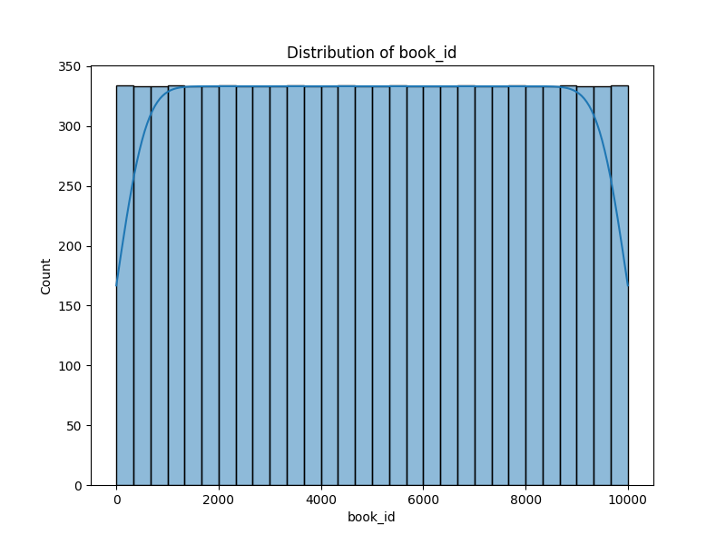
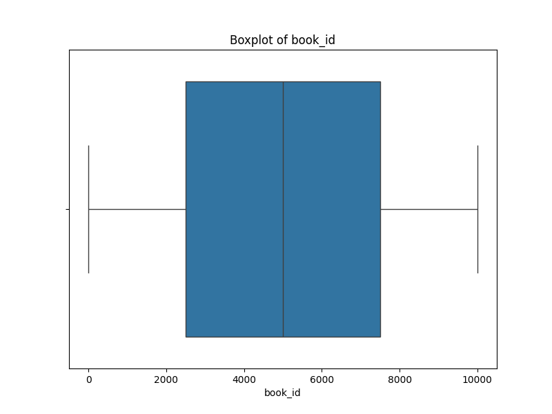

# Analysis Report

### Narrative on Book Dataset Insights

In our connected world, literature acts as a bridge, transcending time and culture to weave stories that resonate with readers. Our evaluation of a comprehensive dataset encompassing 10,000 books offers a fascinating glimpse into this literary landscape, revealing trends, uncovering gaps, and stimulating thought on the nature of reading today.

#### A Tapestry of Data
As we delve into the dataset, we find ourselves surrounded by a wealth of identifiers that make each book distinct. The unique IDs serve as navigational tools, guiding us through the intricate web of authors, publication years, and ratings. The variety of editions reflected in the `books_count` column highlights how these stories evolve and adapt in different formats (e.g., print, ebook, audiobook), catering to diverse reader preferences.

#### Understanding Reception: A Rating Perspective
Analyzing reader feedback brings us face-to-face with the varied reception of these literary works. The average ratings paint a picture of general satisfaction among readers, with titles like "The Hunger Games" leading the pack with an astounding 4.7 million ratings—a testament to its overwhelming popularity. This observation leads us to ponder how word-of-mouth, cultural relevance, and marketing strategies converge to propel specific books into the limelight.

#### Authors: The Heart of Literature
Our exploration of the authors who populate this dataset reveals a significant concentration of well-known names. Writers like Suzanne Collins, J.K. Rowling, and Stephenie Meyer dominate with their resounding impact on readers’ imaginations. However, the equally important voices of lesser-known authors await their moment to shine. Understanding the dynamics between popular authors and emerging voices could unlock avenues for promoting diverse literature that deserves recognition.

#### The Passage of Time: Publication Trends
Every data point in the `original_publication_year` column serves as a marker of cultural evolution and changing societal narratives. A close examination of this timeline could yield insights into shifts in literary themes, genres, and even societal values. Were certain genres more prevalent in specific decades? Are we witnessing a renaissance of classic literature in today's book market, or do contemporary themes dominate shelf space? 

#### Language Matters: A Multilingual Lens
As we uncover the missing entries in the `language_code` column, we realize an opportunity lies before us. Language not only enriches the reading experience but shapes how stories are told and received. The absence of language data urges us to ask: are we missing out on brilliant stories from underrepresented languages? Exploring the ties between language and reader reception might reveal disparities in what stories resonate based on cultural context.

#### Charting a Better Future: Recommendations Ahead
Armed with these insights, we’re led to actionable recommendations that promise deeper understanding and broader perspectives. Addressing the missing data is paramount; filling gaps will not only enhance data integrity but also lead to more reliable analyses. A trend analysis of publication years could unveil newfound narratives in the literary world. Understanding how ratings correlate with the sheer volume of reader feedback might also reshape how we perceive literary success.

The journey does not end with analysis; visualization holds the power to further engage audiences. By illustrating our findings through compelling visuals, we can convey complex insights succinctly, allowing for broader discussions around literature’s role in society today.

### Conclusion
This dataset is more than a collection of book identifiers and ratings; it's a testament to our collective experiences as readers, our cultural narratives, and the evolving nature of storytelling. Let us leverage these insights to celebrate stories, promote inclusivity, and foster a robust literary culture that honors both the voices of the past and the stories waiting to be told. Together, we can illuminate the intricate connections between literature, society, and the readers who champion them.

## Visualizations

