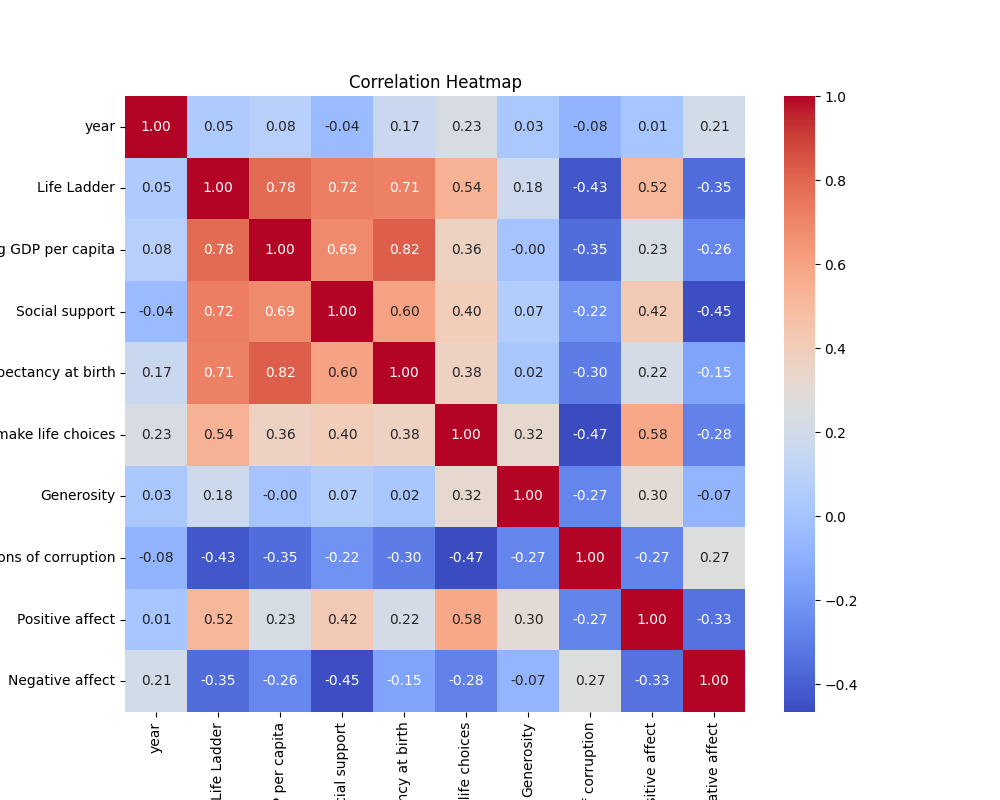
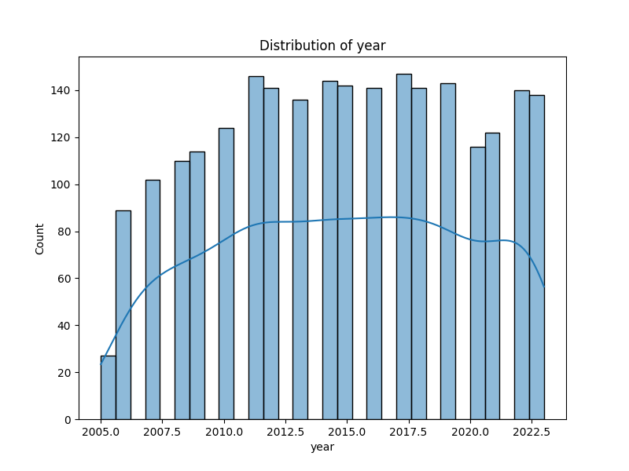
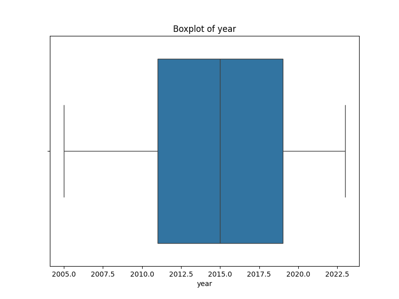

# Analysis Report

### Narrative on Happiness and Quality of Life Across Countries

In our quest to unravel the intricate relationship between socio-economic factors and the subjective sense of wellbeing often encapsulated by the term 'happiness', we've uncovered a compelling dataset containing insights from 165 unique countries spanning various years with a total of 2363 entries. This dataset is rife with indicators that speak to both the material conditions of life—like GDP and health expectancy—as well as the more intangible dimensions of existence, such as perceived freedom and social support.

#### The Landscape of Happiness

The **Life Ladder** is the cornerstone of our analysis, serving as a barometer of subjective wellbeing. As we delve into the data, it becomes evident that understanding what drives this measure involves a multi-faceted approach. The interplay between economic prosperity—as indicated by **Log GDP per capita**—and emotional experiences, represented by **Positive affect** and **Negative affect**, presents a complex picture. 

One might intuitively assume higher income brings greater happiness. However, the dataset invites us to reconsider this simplistic correlation. There are numerous instances where high GDP does not translate into high Life Ladder scores. This anomaly is often tied to the social fabric within countries, as highlighted by the **Social support** metric. Countries that prioritize community and connectivity tend to show higher life satisfaction rates, regardless of their economic standing.

#### Trends Over Time

The examination of trends over time is particularly revealing. For instance, a longitudinal analysis can demonstrate that nations showing consistent enhancements in **Social support** often correlate with increases in Life Ladder scores, despite fluctuations in GDP. This highlights a pivotal insight: while economic growth is crucial, the community's health and individual perceptions of support have profound effects on overall wellbeing.

Conversely, looking at countries that have seen declines in their Life Ladder scores becomes a cautionary tale. In nations where **Perceptions of corruption** have risen, one often finds a corresponding dip in happiness, illustrating how trust in governance and societal structures can profoundly impact individuals' happiness levels. 

#### Correlations and Causalities

Digging deeper into correlations unveils intriguing relationships worthy of exploration. The strong correlation between **Freedom to make life choices** and **Life Ladder** scores suggests that autonomy is a vital ingredient in individuals' satisfaction with life. In countries where individuals feel they have agency, happiness flourishes.

On the flip side, high levels of **Perceptions of corruption** often emerge as strong predictors of low life satisfaction, making a case for prioritizing transparent and accountable governance as a pathway to enhancing overall societal wellbeing. 

#### The Challenge of Missing Data

Reflecting on the missing data elements reveals potential pitfalls in our analysis. For instance, missing values for **Generosity** and **Perceptions of corruption** could skew interpretations and lead to incomplete narratives. Addressing these gaps—either through imputation methods or transparency about their implications—will ensure that our findings remain robust and reflective of the true landscape of happiness.

#### The Path Forward

As we venture beyond mere description and into predictive modeling, we are poised to identify which factors most significantly influence our Life Ladder scores. By conducting regression analyses using the metrics at our disposal, we can create frameworks that policy-makers and communities might leverage to cultivate environments where happiness thrives. 

Ultimately, this narrative is not just an academic exercise; it carries profound implications for the policies and practices that can enhance life quality worldwide. Prioritizing social infrastructure alongside economic development could pave the way for happier, healthier societies.

In conclusion, the dataset serves as a powerful reminder that happiness is a tapestry woven from various threads—economic prosperity, social connections, personal freedoms, and the absence of corruption. These insights compel us to advocate for holistic approaches that inspire communities to flourish across the globe.

## Visualizations

