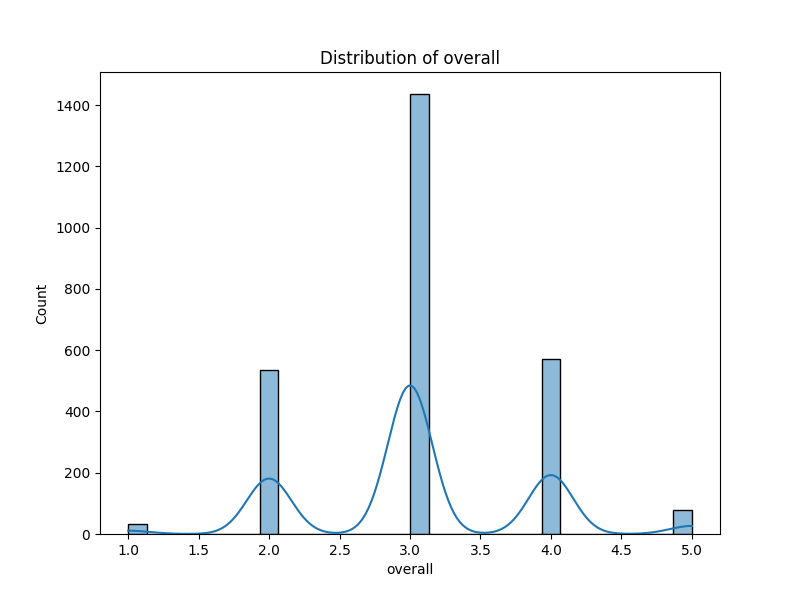
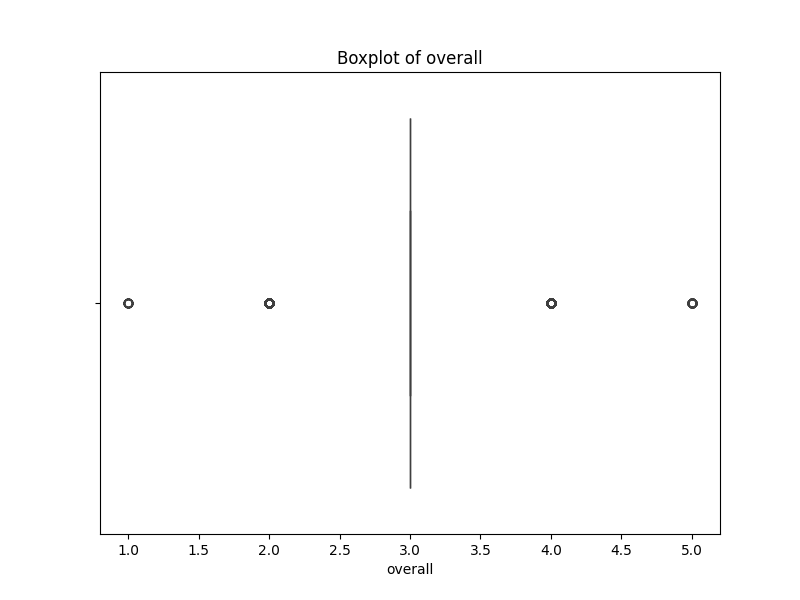

# Analysis Report

### Narrative: Insights from the Movie Dataset Analysis

In an ever-evolving cinematic landscape where audience preferences shape the future of film, the dataset presented offers a compelling snapshot of contemporary movie reception. With a total of 2,652 entries reflecting movies released over time, the analysis serves as a gateway to understanding both the art of cinema and the audience's taste.

#### A Portrait of Diversity

Diversity shines through this dataset, both in terms of language and the breadth of talent involved. Across 11 unique languages, the dataset encapsulates a wide array of cultural perspectives, with English leading the pack as the most represented language with 1,306 entries. This dominance perhaps not only mirrors the global impact of Hollywood but also raises questions about the accessibility and reception of non-English films. Future analysis could delve into how cultural nuances influence movie ratings and audience connections, especially for international films that may struggle to find their footing in markets dominated by English-language productions.

#### The Ratings Landscape

The average ratings reflect a generally favorable reception, with overall ratings sitting at 3.05 and quality ratings at 3.21 on a scale from 1 to 5. Though the majority of movies received positive reviews, the inherent variability indicated by standard deviations underscores a wide spectrum of audience sentiment. This hints at a rich tapestry of viewer experiences, highlighting that while some films resonate strongly with their audiences, others may miss the mark. 

Delving deeper, the distribution of these ratings could reveal trends related to genres, production companies, or even historical contexts of release, shedding light on the changing landscape of cinematic standards over the years. 

#### The Impact of Missing Data

A significant aspect to consider is the missing values within the dataset, particularly in the "by" field where 262 entries lack information about the creators or cast. This gap presents a challenge — the absence of recognizable names may also correlate with lower ratings due to reduced visibility or star power. Moreover, the 99 missing dates could hinder temporal analyses, preventing a fully accurate narrative of how movie reception has evolved. Addressing these missing entries through imputation or careful analysis may reveal vital trends and connections.

#### Rewatchability: A Binary Measure of Endurance

Intriguingly, the analysis highlights that all entries scored '1' in repeatability, suggesting that each movie is likely considered worth a rewatch. This uniform rating invites inquiry into what qualities foster this sentiment. Is it the engaging storytelling, compelling performances, or perhaps nostalgic value? Further research could uncover the characteristics that lead a film to earn a place in a viewer's personal collection, influencing marketing strategies for future releases. 

#### Moving Forward: Paths for Exploration

As we peel back the layers of this dataset, several avenues for further exploration emerge. Tracking trends over time can illuminate shifts in audience preference and production quality, allowing creators to adapt. The intersection of language and rating can reveal cultural biases or preferences that influence how stories are received. Lastly, a focus on the impact of well-known actors could highlight the economic implications of star-led projects and how they influence the industry at large.

### Conclusion

This dataset encapsulates more than just numbers; it tells a story of how movies are experienced and interpreted by audiences around the globe. By leveraging these insights, stakeholders in the film industry can make informed decisions, tailored marketing strategies, and ultimately, better connect with the myriad of viewers who continue to shape the world of cinema today. As trends emerge, the evolving narrative of film and audience interaction becomes not just a reflection of the past but a guiding light for the future of filmmaking.

## Visualizations

